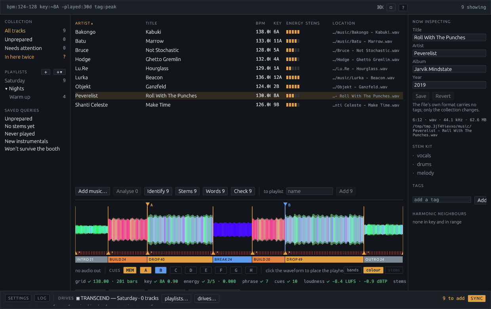
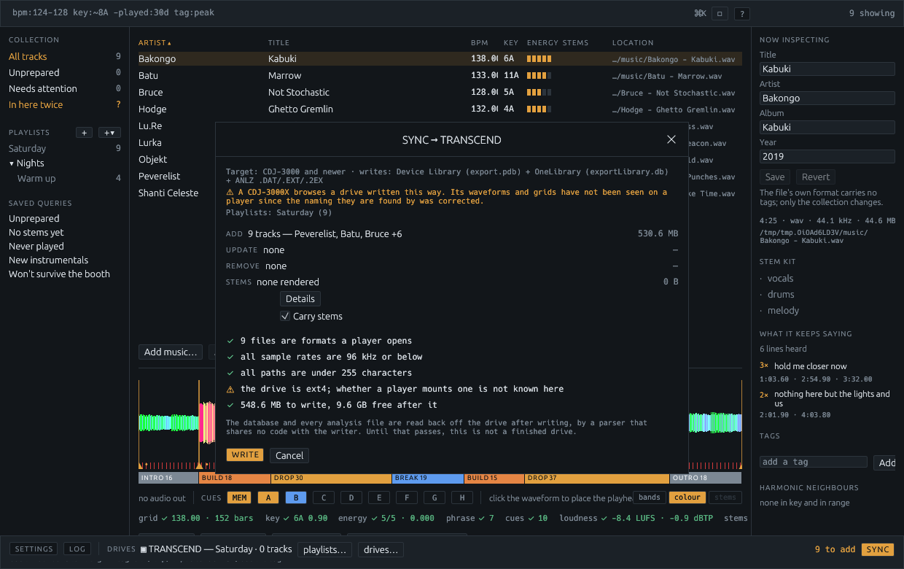
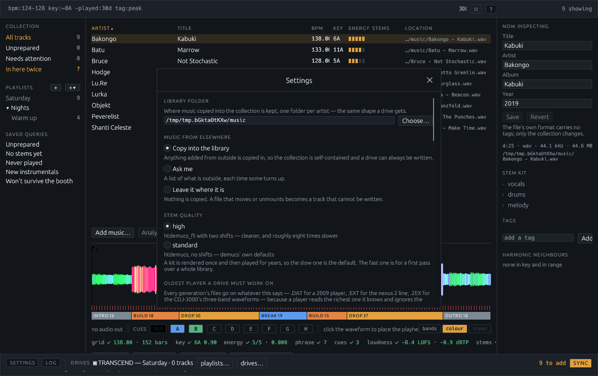
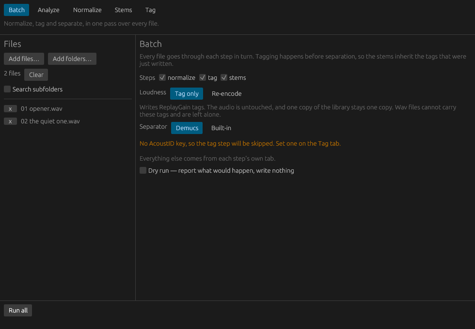

# Booth

A DJ library that prepares tracks and writes the USB drives a Pioneer / AlphaTheta player reads —
without rekordbox anywhere in the process.

A **CDJ-3000X on firmware 1.40** browses and plays a drive this writes, with nothing rekordbox has
touched on it: playlists, track list, key search, colour waveforms, beat grid and hot cues on a
loaded track. That is the newer of the two on-drive database formats, which every player sold
since 2023 needs and which no other free tool had been seen to write.

```sh
cargo run --release          # the library window
```



Everything runs on your machine. Nothing is uploaded, there is no account, and the one thing that
needs the network — asking AcoustID and MusicBrainz what a recording is — is a feature you turn on
with a free key.

## What it does

- **Holds a collection.** Import files or a whole rekordbox library, browse them in one window,
  edit tags in place, find duplicates by the sound rather than the name, and check the collection
  against the files it describes.
- **Listens to every track.** Tempo, beat grid, key, phrases, cue points and the colour waveforms
  a player draws, all measured locally. No analysis step on the player, no waiting in the booth.
  A record at one tempo is gridded at one tempo — eight beats from anywhere in it are eight beats
  from anywhere else — and one that really moves is gridded moving.
- **Levels them.** EBU R128 loudness normalisation, by re-encoding or by ReplayGain tags with the
  audio left untouched.
- **Names them.** Acoustic fingerprinting through AcoustID and MusicBrainz, and — for the white
  labels and promos no database has heard of — what the file's own path says it is.
- **Splits them.** Vocals, melody and drums as separate stems, rendered ahead of time.
- **Reads the words.** The vocal stem goes through a speech recogniser, and what comes back is
  read for repetition: the line the room sings becomes a cue, every time it comes round becomes a
  marker that says which line it is, and the whole of it is in the panel — so months later you
  know which record this is from the thing you actually remember about it.
- **Writes drives a player will open.** Both on-drive databases from one collection, so they
  cannot disagree about what is on the stick, with everything read back and checked afterwards.
  Every generation's analysis files go on — `.DAT`, `.EXT` and `.2EX` — so one stick works from
  a 2009 deck to a CDJ-3000X.
- **Checks the drive against the booth it is going to.** You say the oldest player it has to
  work on; the checks use that generation's rules, and anything it cannot open — a FLAC on a
  nexus deck, a 96 kHz file on an NXS2 — is re-encoded to a 320 kbps MP3 on the way onto the
  stick. Your library keeps its lossless copy. (The files for older players are all written; a
  CDJ-3000X on firmware 1.40 and a CDJ-1500X on firmware 1.10 both browse a drive from here,
  while one CDJ-3000 on firmware 2.05 refused one — see
  [what it does not do yet](booth/README.md#what-it-does-not-do-yet).)
- **Keeps a copy of every drive.** Databases and analysis copied, audio hard-linked, so a backup
  of a 64 GB stick costs megabytes. What a player recorded having played comes back as playlists.
  Music on the stick the collection does not have is copied in, and a track the collection
  names but the disk has lost is put back — because the stick that could fix it will not be
  there for ever.
- **Says what will be slow before the night does.** A quarantined file, one still sitting in
  Downloads, or one inside Dropbox or iCloud is seconds to open rather than milliseconds. Booth
  says so at import and takes the quarantine flag off when you ask.

Every button, box and switch says what it does when the pointer rests on it, and how long it
waits is a setting. `⌘,` opens Settings, which is also where the colour scheme lives — eleven of
them, out of editors and one of this program's own.

[`booth/README.md`](booth/README.md) is the whole of it, screen by screen.

| | |
|---|---|
|  |  |
| Writing a drive: what goes on, what the target player will take, and what the drive is formatted as. | Settings, including which generation of player the drives have to work on. |

## The parts

| | |
|---|---|
| [`booth/`](booth/README.md) | The library window. This is the program, and what `cargo build` builds. |
| [`proto/musicai/`](proto/musicai/README.md) | `booth-cli`: the engine — analysis, loudness, stems, tagging, the drive writer — and the command of the same name around it. It came first, which is all `proto/` and the directory's old name mean. |
| [`gui/`](gui) | `booth-gui`, the older batch window: pick files, pick a task, run it. |
| [`docs/`](docs) | The [spec](docs/rekordbox-replacement-spec.md) this is built to, and [what is known](docs/onelibrary.md) about the format the newer players read. |

```sh
cargo build --release              # Booth
cargo build --release -p booth-cli  # the command-line tool
cargo build --release --workspace  # all of it
```

## The macOS app

`scripts/package-macos.sh` builds **Booth.app**: the library window, universal for Apple silicon
and Intel, with the `booth-cli` command-line tool inside the same bundle so one download is both.

### The batch window

There is a second, older window — `booth-gui` — which is the command-line tool's jobs one at a
time. Pick a task along the top, drop files on the left, set the options in the middle, press the
button. Results appear in the log at the bottom as they arrive, and a long job can be stopped
without leaving a half-written file behind.

It opens on **Batch**, which is the pipeline: tick the steps you want and press Run all. Each step
uses the settings on its own tab, so there is one place to configure anything and no second copy of
every control. The step being run is shown next to the progress bar as the run moves through them.

Stems default to `~/Music/musicai-stems` rather than the command line's relative `stems`, because
an app launched from the Finder has no useful working directory.

It is not in the bundle: run it with `cargo run -p booth-gui`.



### Building it

```sh
scripts/package-macos.sh
# dist/Booth.app and dist/booth-0.1.0.dmg
```

It builds each binary twice and `lipo`s the pairs together, so the result runs natively on either
architecture. That needs both targets installed:

```sh
rustup target add aarch64-apple-darwin x86_64-apple-darwin
```

The bundle carries **both** binaries — the app you launch and the `booth-cli` command-line tool, at
`Booth.app/Contents/MacOS/booth-cli`. One download gives you both, and they can never be different
versions of each other. Symlink it onto your `PATH` if you want it there:

```sh
ln -s /Applications/Booth.app/Contents/MacOS/booth-cli /usr/local/bin/booth-cli
```

To run either window without packaging anything:

```sh
cargo run -p booth --release        # the library
cargo run -p booth-gui --release    # the batch tool
```

Files named on the command line are imported by Booth at startup, and start out selected in the
batch window. That is also how Finder's *Open With* hands over a selection.

### Signing

Without a Developer ID the app is ad-hoc signed: it runs on the machine that built it, and
Gatekeeper stops it anywhere else until you right-click and choose *Open*. With one, set the
environment and the script does the rest:

```sh
BOOTH_SIGN_IDENTITY="Developer ID Application: Your Name (TEAMID)" \
BOOTH_NOTARY_PROFILE=my-notary-profile \
    scripts/package-macos.sh
```

`.github/workflows/macos-app.yml` builds the same thing on a macOS runner and puts the disk image
on the release, three ways in: a release published from GitHub's own web interface, a tag pushed
from a shell (`v1.0` and `1.0` both count), or by hand from the Actions tab, where naming a tag
attaches the build to a release that is already out. That last one is the only way to fix a
release after the fact, since a tag that already exists is never pushed again.

The disk image and the bundle take their version from the tag rather than from `Cargo.toml`, so
two releases are two files you can tell apart. A tag macOS would not accept as a version — a `-rc1`
on the end, say — falls back to the manifest rather than building something that will not launch.

### What the batch window is, and is not

It is a front end, not a second implementation. Every option is the command-line tool's own
argument struct, filled in with the defaults clap would apply, and pressing the button calls the
same function the CLI calls. A default cannot drift between the two, and an option added to the
CLI without a control in the window is a compile error rather than a silent difference. The
command line that matches what you have set up is printed in the log when a job starts, so you can
run it once in the window and then copy the line into a script.

## The pictures

`scripts/screenshots.sh` re-takes every screenshot in these READMEs: it builds the window with
its layout-check hooks in, fills a scratch collection from
[`booth/examples/demo_library.rs`](booth/examples/demo_library.rs), and photographs the same
three screens. The collection is fixed, so two runs give two comparable pictures, and none of
it is anybody's music.

Worth doing whenever the window has moved — more than about 5% of the code changed since the
last time is a good sign it has.

## Tests

```sh
cargo test --workspace
```

`--workspace`, because a plain `cargo test` runs only Booth's own — the same reason a plain
`cargo build` builds only Booth. Everything is offline: what would talk to AcoustID or
MusicBrainz is `#[ignore]`d and run on purpose. `.github/workflows/ci.yml` runs the suite,
clippy with warnings as errors, and a format check on every push.

Each crate's README says what its own tests cover. The short version: the drive writer's output is
read back by [`rekordcrate`](https://github.com/Holzhaus/rekordcrate), a separate implementation
by other people, so a misunderstanding of the format cannot be symmetrical and invisible; and the
window is driven through its own accessibility tree, so its tests click real buttons.

## What this is not

It does not stream, it does not sync to a cloud, and it will not play out to a club by itself —
the deck in the window is for listening to what you are preparing. It is not affiliated with
AlphaTheta or Pioneer DJ, and the on-drive formats it writes were worked out from public research
and a lot of hexdumps, which [`docs/onelibrary.md`](docs/onelibrary.md) records in full, including
the parts that turned out to be wrong.

## License

The [Booth Public Source License](LICENSE): free to download, run and modify for personal,
educational and internal use, and free to redistribute through non-commercial and open-source
channels. Putting it inside a proprietary commercial product needs a separate licence from the
copyright holder. It is not an OSI-approved licence, so GitHub shows it as "Other".
